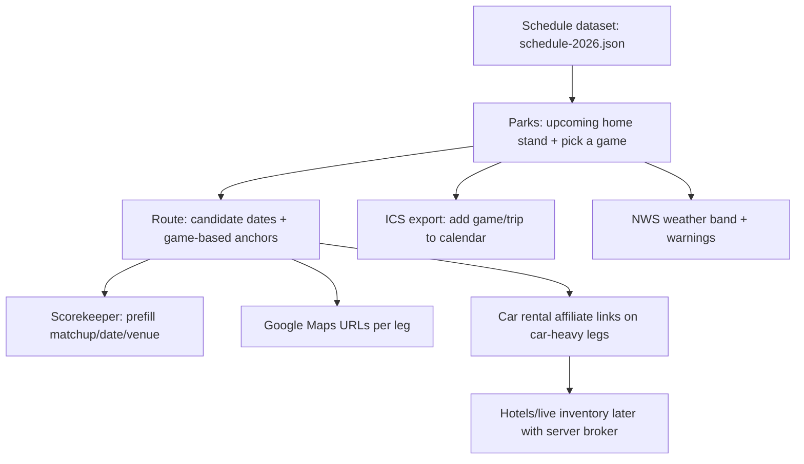

# Ballparks Quest Integration Viability Deep Research

## Executive summary

Ballparks Quest is explicitly positioned in-code as “Static · Local first · No dependencies,” which is the right architectural constraint for a personal-planning tool that should work reliably on the road and at ballparks. citeturn16view0 The practical consequence: integrations only “fit” if they (a) **require no secrets in the browser**, (b) **tolerate intermittent connectivity**, (c) **don’t break core flows when they fail**, and (d) **map directly to your funnel**: pick a game → plan the trip → score it.

The viability report you provided is directionally strong. Research against primary docs supports these conclusions, with a few important caveats:

- “Notion live at runtime” is a weak fit for a static app because the Notion API uses Bearer tokens and versioned API headers, and it is rate-limited; embedding tokens in client code is incompatible with safe secret handling. Build-time export is the right design. citeturn1search2turn1search0turn28search0  
- iCalendar (`.ics`) is the highest-leverage “calendar integration” for static hosting: it is standardized (RFC 5545), widely importable (Google Calendar explicitly supports importing `.ics`), and requires no OAuth. citeturn0search1turn0search4turn12view0  
- Google Maps URLs are explicitly designed for universal launch, and you do not need an API key; they’re an ideal fit for route legs. citeturn0search0  
- NWS weather API is attractive (official, free, no API key), but the **browser-client reality** needs care: NWS enforces User-Agent requirements in some situations; and custom User-Agent headers can be unreliable across browsers and can trigger CORS preflights if you try to set them manually. Plan for caching, throttling, and graceful failure. citeturn8search0turn2search0turn27search0turn8search4  
- Affiliate links (Expedia Group) are a strong “static monetization” path, but you must implement **clear, proximate affiliate disclosures** (FTC guidance is explicit that vague terms like “affiliate link” may not be sufficient by themselves). citeturn2search1turn7search2  
- Booking.com Demand API is **not compatible** with “secrets stay off the client” (it requires a bearer token and affiliate ID, and their docs explicitly warn not to store keys in source code). It becomes viable only with a server-side broker (or a later non-static architecture). citeturn4search0turn4search2  
- Ticketmaster Discovery API is technically feasible in a static app because it supports CORS and uses a simple API key model, but it introduces quota/key-abuse risk and terms-of-use constraints (especially around caching and not replicating Ticketmaster’s core experience). citeturn13search0turn3search0turn13search5  

### Fit matrix (static/local-first reality)
| Integration | Fit for static GitHub Pages | Why it fits / doesn’t | “Least regret” implementation pattern |
|---|---|---|---|
| Schedule dataset (Notion → JSON) | **High** | Avoids runtime auth + rate limits | Build-time export to `schedule-2026.json` |
| Schedule dataset (MLB team CSV pages) | **High** | Official downloadable schedules exist; CSV is stable input | Build-time fetch CSV(s) → normalize → JSON citeturn22view0 |
| `.ics` download | **Very high** | Standard + importable; no OAuth | Client-side generate `.ics` per game/trip citeturn0search1turn12view0 |
| Google Maps URLs | **Very high** | No API key; universal launch | Client-side URL builder per route leg citeturn0search0 |
| NWS weather | **Medium–High** | No key; official; but UA/CORS caveats | Runtime fetch + caching + circuit breaker citeturn2search0turn8search0turn27search0 |
| Expedia affiliate links | **High** | Pure links; no secrets; scalable | Contextual deep links + FTC disclosure citeturn2search1turn7search2 |
| Google Calendar direct write | **Medium** | Possible, but OAuth complexity + token handling | Phase 2+; OAuth JS client + PKCE citeturn5search0turn4search7 |
| Booking Demand API live inventory | **Low (static)** | Requires secret tokens; partner gating | Only after adding a server-side broker citeturn4search0turn4search2 |
| Ticketmaster Discovery overlays | **Medium** | CORS-friendly; but quota/TOS/caching rules | Optional “event context” enhancer citeturn13search0turn13search5 |

## Evaluation framework for “static, local-first” integrations

Your constraint (“Static · Local first · No dependencies”) is not just a deployment choice; it’s a product promise. citeturn16view0 A rigorous integration framework for this style of app is:

### Secretlessness
Any integration requiring a reusable credential (API keys that must remain confidential, bearer tokens, partner credentials) is **structurally incompatible** with purely client-side execution. OWASP explicitly treats API keys and similar credentials as “secrets” that commonly get hardcoded and leaked; safe patterns keep secrets out of source code and out of public repos. citeturn28search0

### Degradation
If an integration fails (offline, rate-limited, blocked by CORS), the app should still work. In practical UI terms: integrations should be “enhancements,” not gatekeepers.

### Low-friction flow alignment
The integration must serve one of your three core steps:
- pick a game (schedule + venue context)
- plan the trip (maps + weather + cost signals)
- score it (prefilled matchup + date/venue anchoring)

Your current code already encodes these surfaces:
- Route planner is designed to compare “friction,” with a note parser that extracts **date/price anchors** from leg notes. citeturn19view1turn19view0  
- Scorekeeper already supports a “context” handoff from the rest of the app via `getScorekeeperContext()`, but it currently only passes “home team” and “venue,” not the opponent or game time. citeturn18view0turn16view3  

## Integration viability findings with primary-source grounding

### Schedule data as the “unlock”
Your viability report is correct that a local schedule dataset turns the Route and Scorekeeper from “abstract tools” into a cohesive product. Two sourcing strategies are realistically viable:

#### Build-time export from Notion
Notion’s API requires Bearer auth and a required `Notion-Version` header; Notion also changes API versions and deprecates older versions, which is a maintenance risk if you depend on live calls. citeturn1search2 Notion is also rate limited (documented average 3 requests/second per integration, with 429 handling expectations). citeturn1search0

**Conclusion:** runtime Notion calls are a poor fit for “no secrets on the client.” Build-time export is a strong fit.

#### Build-time ingest from MLB downloadable schedule pages
MLB team sites provide downloadable schedules as CSV for the season; these pages also warn that CSV downloads don’t automatically stay updated, which is consistent with treating this as a periodic ingest step. citeturn22view0 This is a strong “official input” option when you want to reduce manual entry and align with “primary sources: official MLB resources.”

**Practical recommendation:** even if you author/curate in Notion for *your* workflow, use MLB CSV as a validation source and reconciliation check (detect missing games/time changes).

### Calendar integration via `.ics`
This is the cleanest calendar path for static apps because it is:
- Standardized around VCALENDAR/VEVENT objects (RFC 5545) with well-defined date semantics (DTSTART/DTEND) and required unique identifiers (UID). citeturn0search1turn0search4  
- Explicitly supported for import in Google Calendar (import `.ics` on computer; help docs even describe the required lines like `BEGIN:VCALENDAR`, `BEGIN:VEVENT`, etc.). citeturn12view0  

**Key caveat (product expectation):** `.ics` import is not inherently a “live subscription” unless you provide a hosted `.ics` URL that clients poll. Google’s help explicitly distinguishes importing vs syncing/sharing. citeturn12view0  
That’s fine for your use case (“Add this game/trip weekend”), but you should present it as a one-time add, not guaranteed live updates.

### Google Maps URLs
Google’s own documentation states that Maps URLs:
- launch Google Maps cross-platform from a website/app,
- use a consistent parameter scheme (`api=1`, `origin`, `destination`, `travelmode`, optional waypoints),
- and do not require an API key for this URL-based launch pattern. citeturn0search0turn0search2

**Fit:** perfect for “Open drive route / transit route / park location,” because it’s zero-secret, and “failure mode” is simply “link doesn’t open maps.”

### Weather via NWS API
The NWS Web Service documentation describes:
- `/points/{lat},{lon}` → discover the correct grid office and endpoint,
- `/gridpoints/{office}/{gridX},{gridY}/forecast` for forecasts,
- guidance that you may cache grid mappings for latency, but must check the /points mapping periodically because office/grid values can change. citeturn2search0  

The NWS FAQ states you can get blocked (403) if you do not include a User-Agent header; they recommend an app-identifying UA with a contact email (and note they may move toward API keys in the future). citeturn8search0  

**Static-app caveat:** browser fetch clients have limitations around manual header setting. MDN notes that while User-Agent is *no longer forbidden by spec*, Chrome may silently drop it if you try to set it manually. citeturn27search0 Community reports (in the NWS API GitHub discussions) also highlight that attempting to set custom headers can trigger CORS preflights and fail if headers aren’t allowed. citeturn8search4  

**Conclusion:** viability is “high” only if you:
- do not rely on custom User-Agent strings,
- minimize request frequency,
- implement caching and timeouts,
- and accept that this is a planning hint, not a guaranteed live layer.

### Car rentals via affiliate links
The Expedia Group Affiliate Program positions itself around trackable links/widgets and commissions “up to 4%” for qualifying bookings, which indicates a link-based monetization model is first-class and not dependent on API credentials. citeturn2search1 Their help center documentation also describes affiliate link generation as a trackable URL you can paste and use. citeturn2search4  

**Compliance requirement:** the FTC’s Endorsement Guides guidance explicitly addresses affiliate marketing: you should disclose your relationship “clearly and conspicuously,” and they note that “affiliate link” by itself may not be adequate because consumers might not understand it. citeturn7search2

**Conclusion:** viability is high, but only if you ship disclosure UX as part of the feature.

### Direct Google Calendar write (events.insert)
Google Calendar’s API method `events.insert` explicitly “requires authorization,” meaning you need an OAuth-enabled flow, and you’ll be handling user consent and tokens in the client. citeturn5search0 Google’s JavaScript quickstart demonstrates that you must enable the API in a Google Cloud project and create OAuth client credentials; it also notes “client secrets aren’t used” for web applications, which aligns with browser-based app constraints. citeturn5search1

OAuth guidance for SPAs emphasizes that browser apps cannot keep a client secret and should use PKCE (and that older implicit flows have security issues). citeturn4search7  

**Conclusion:** your “viability: medium” rating is correct—this is a later-phase optimization if (and only if) `.ics` export proves demand.

### Booking Demand API live inventory
Booking.com Demand API docs state authentication requires:
- `Authorization: Bearer <key>` and `X-Affiliate-Id: <aid>` in every request,
- and they explicitly instruct: “Don’t store the key directly in your application’s source code,” plus “don’t store an unencrypted key in a source control repository.” citeturn4search0turn4search2  

Rate limits are also enforced (docs describe a non-configurable 50 requests/minute in general, and separate guidance for cars). citeturn3search1

**Conclusion:** this is incompatible with a static client-only app unless you add a server-side broker that keeps secrets off-client.

### Ticketmaster Discovery API overlays
Ticketmaster’s docs are unusually friendly for static clients:
- they explicitly describe CORS support for their APIs, citeturn13search0  
- and list default quota/rate limits for API keys (5,000 calls/day and 5 requests/second). citeturn3search0  

But constraints matter:
- Their Terms of Use restrict uses (including not replicating Ticketmaster’s essential experience) and limit caching/storing of “Event Content” beyond “reasonable periods,” and they reserve the right to rate limit/block heavy usage. citeturn13search5  

**Conclusion:** “viability: medium” is well-supported: use it as a conflict/context signal (nearby events, crowd distortion), not as a ticketing replacement.

## Concrete implementation blueprint for Ballparks Quest

### Where integrations plug into your existing UI/code

#### Parks page: “Upcoming home stand” panel
The park detail component is already structured to show data blocks (`d-grid`, `d-signals`) and has a scratchpad for research notes. citeturn15view3  
This is the correct location to add:
- “Next home stand” (series list + dates)
- “Next game” CTA: (a) add to calendar (.ics), (b) add to route, (c) open in maps

#### Route page: “Real candidate dates”
Route legs already derive anchor blocks from notes (date/price/warning extraction) and show warning banners and “ticket behavior” signals. citeturn19view0turn19view2  
Schedule data allows you to populate anchor chips from real games instead of manual text parsing (keep manual override as fallback).

#### Scorekeeper page: “Prefill actual matchup”
Scorekeeper initializes metadata using `getScorekeeperContext()`, which today only contains `venue`, `homeTeam`, `parkId`, etc. citeturn16view3turn18view0  
You can extend the context payload to include:
- `gameId`
- `awayTeam`
- `startDateTime`
- `attendance` (optional, user entered)
- `weatherSummary` (optional)

### Proposed `schedule-2026.json` minimal schema
Goal: enough to drive Parks/Route/Scorekeeper with zero runtime dependencies.

```json
{
  "season": 2026,
  "generatedAt": "2026-03-18T00:00:00Z",
  "source": {
    "type": "build-export",
    "inputs": ["notion", "mlb-team-csv"],
    "notes": "normalized to parkId"
  },
  "games": [
    {
      "gameId": "mlb-2026-04-12-PHI-NYM-1",
      "parkId": "citizens-bank-park",
      "homeTeam": "Philadelphia Phillies",
      "awayTeam": "New York Mets",
      "startDateTimeLocal": "2026-04-12T19:05:00-04:00",
      "seriesId": "mlb-2026-PHI-vs-NYM-04-10",
      "tags": ["weekend", "rivalry", "promo?"],
      "ticketUrl": "https://…",
      "notes": ""
    }
  ]
}
```

This schema is intentionally “boring”: it keeps only what you can safely ship and render, and avoids storing secrets or brittle third-party IDs.

### `.ics` generation: correct minimum fields
Google Calendar Help describes the required VCALENDAR/VEVENT framing lines, and RFC 5545 defines VEVENT date semantics and UID requirements. citeturn12view0turn0search1turn0search4

A minimal `.ics` (single event) looks like:

```text
BEGIN:VCALENDAR
VERSION:2.0
PRODID:-//Ballparks Quest//EN
BEGIN:VEVENT
UID:bpq-mlb-2026-04-12-PHI-NYM-1@ballparksquest.local
DTSTAMP:20260318T000000Z
DTSTART:20260412T230500Z
DTEND:20260413T020500Z
SUMMARY:NYM at PHI
LOCATION:Citizens Bank Park
END:VEVENT
END:VCALENDAR
```

Implementation note: generate as a Blob with MIME type `text/calendar` and trigger a download; keep the “Add to calendar” button near the selected game.

### Google Maps URL builder
Google’s Maps URLs guide specifies `api=1` as required and documents `origin`, `destination`, and `travelmode` values. citeturn0search0  
For a route leg, your builder can produce:
- driving: `.../dir/?api=1&origin=lat,lng&destination=lat,lng&travelmode=driving`
- transit: `...&travelmode=transit`

### NWS weather: safest browser approach
Because custom User-Agent setting can be unreliable across browsers (and can trigger CORS complications), use:
- default browser UA (don’t override),
- caching at the park level keyed by `parkId` + “date bucket” (e.g., daily),
- a short timeout (e.g., 2–3 seconds),
- and a UI that degrades to “Weather unavailable” without breaking the page.

This aligns with NWS guidance that grids can change (so cache, but re-check /points periodically) and with their enforcement posture in the FAQ. citeturn2search0turn8search0turn27search0

### Security guardrail: schedule import as an XSS injection vector
The moment you import/export user-editable text (Notion fields, CSV notes, user notes) into HTML, you risk DOM XSS if you render it unsafely. OWASP’s DOM XSS guidance is blunt: prefer safe sinks like `textContent` and avoid `innerHTML` for untrusted data. citeturn28search2turn28search3  
Treat **schedule JSON** as potentially untrusted input anyway (because it may come from tooling, copy/paste, or future “import”).

## Risk register and compliance notes

### Key risks and mitigations
| Risk | Where it appears | Severity | Mitigation |
|---|---|---:|---|
| Secret leakage | Booking Demand API, Notion tokens | High | Build-time export only; never ship bearer tokens; follow OWASP secret storage guidance citeturn4search0turn28search0 |
| Quota exhaustion / key abuse | Ticketmaster API keys in client | Medium | Treat as public, restrict usage to user-triggered actions, cache responses briefly, and stay within terms citeturn3search0turn13search5 |
| CORS / runtime fragility | NWS weather | Medium | Timeout + cache + “weather unavailable” fallback; avoid custom UA header hacks citeturn8search0turn8search4turn27search0 |
| Affiliate disclosure noncompliance | Expedia affiliate links | Medium | Add disclosure copy near links/buttons; don’t rely on “affiliate link” alone citeturn7search2 |
| Calendar phishing optics | `.ics` and calendar links | Low–Medium | Keep descriptions minimal, avoid embedding suspicious URLs in event bodies; present as “generated locally” where appropriate citeturn12view0 |

### Compliance-ready disclosure template (FTC-aligned)
FTC guidance favors disclosures that are *clear, conspicuous, and near the recommendation*. citeturn7search2  
A practical pattern for your UI:
- Under any affiliate button: “Disclosure: We may earn a commission if you book through this link.”
- Keep it inline, not buried in a footer.

## Recommended build order and validation metrics

### Integration sequence (dependency-aware)


### Acceptance tests (what “done” means)
- **No-secrets audit:** repo contains no bearer tokens / affiliate secrets; Booking/Notion credentials not present in shipped JS. citeturn4search0turn28search0  
- **Calendar test:** generated `.ics` imports into Google Calendar and matches RFC expectations for UID and DTSTART/DTEND rules. citeturn12view0turn0search1turn0search4  
- **Maps test:** links open directions with correct travel mode; builder respects `api=1` requirement. citeturn0search0  
- **Weather test:** app remains usable when NWS calls fail; never spams requests; caches results. citeturn2search0turn8search0  
- **Affiliate compliance:** every affiliate link has proximate disclosure text. citeturn7search2  

### Suggested KPIs (integration-specific)
- Schedule engagement: % of users who select a game after viewing a park detail.
- Route conversion: % who add a selected game’s park to route within same session.
- Calendar utility: `.ics` downloads per selected game.
- Navigation utility: Google Maps link clicks per route leg.
- Weather utility: % of park views where weather loads successfully + median load time.
- Monetization: affiliate CTR (click-through) and downstream conversion (as reported by affiliate dashboard). citeturn2search1turn2search4  

### Entity index
(Referenced once each for exploration convenience)  
entity["company","GitHub","code hosting platform"] entity["company","Notion","productivity software"] entity["sports_league","Major League Baseball","us pro league"] entity["company","Google","internet services"] entity["organization","National Weather Service","us weather agency"] entity["company","Expedia Group","travel company"] entity["organization","Federal Trade Commission","us consumer protection"] entity["company","Booking.com","travel booking platform"] entity["company","Ticketmaster","ticketing platform"] entity["organization","OWASP","application security nonprofit"] entity["company","Apple","consumer electronics"] entity["company","Microsoft","software company"]